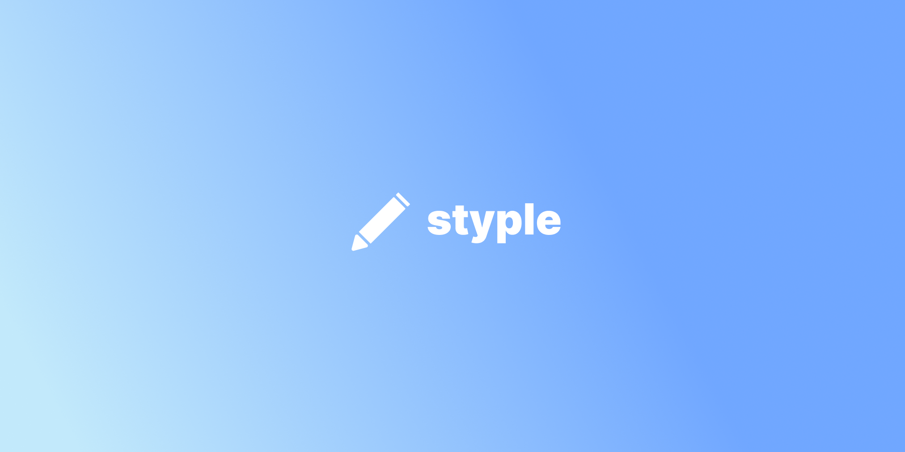

# **styple**

### **An accessible design system for React.**

Built using [Stitches](https://stitches.dev/) and [Radix UI](https://www.radix-ui.com/) with attention to detail.

## Documentation

Read the docs at: [https://styple.dev/docs](https://styple.dev/docs)

## Releases

For an overview: [https://www.styple.dev/docs/overview/releases](https://www.styple.dev/docs/overview/releases)

See release tags here on the repo for full details.

---

Created, maintained and used by [Mikkel](https://www.mikkelbengtsen.com/)
